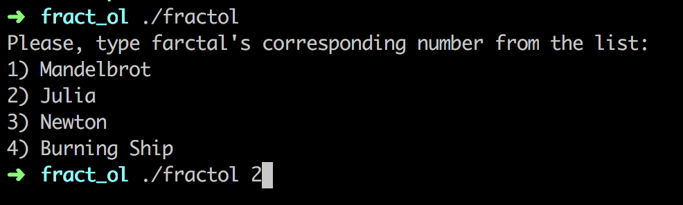
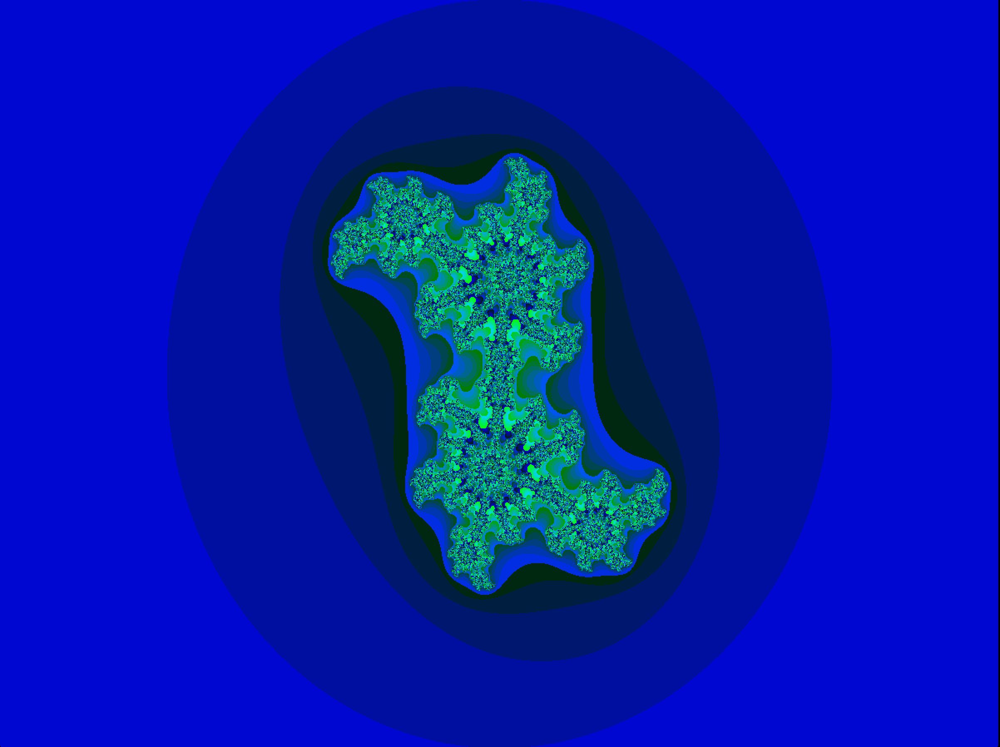
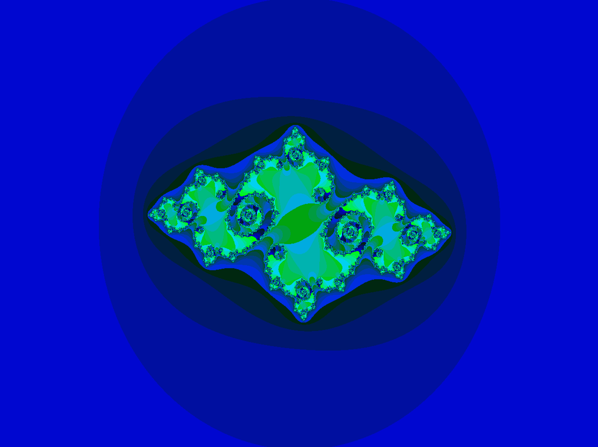
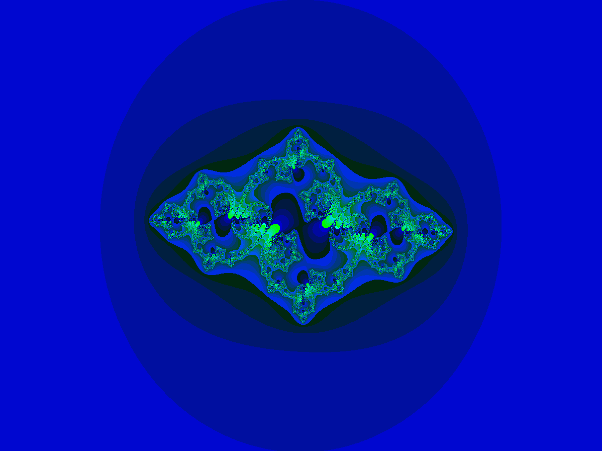
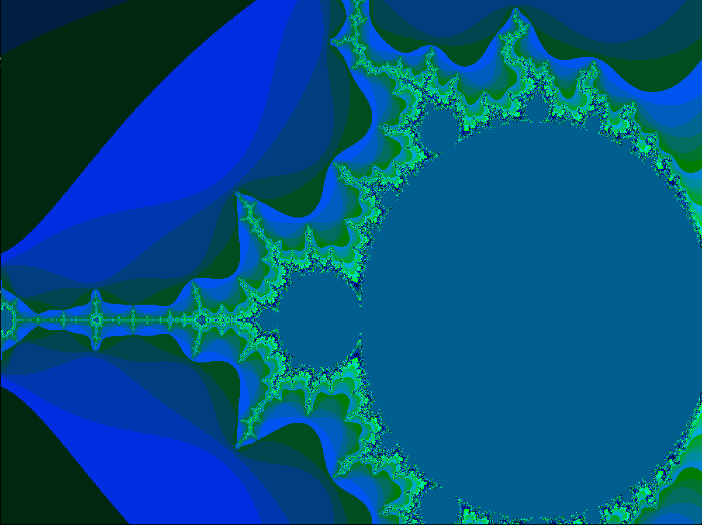
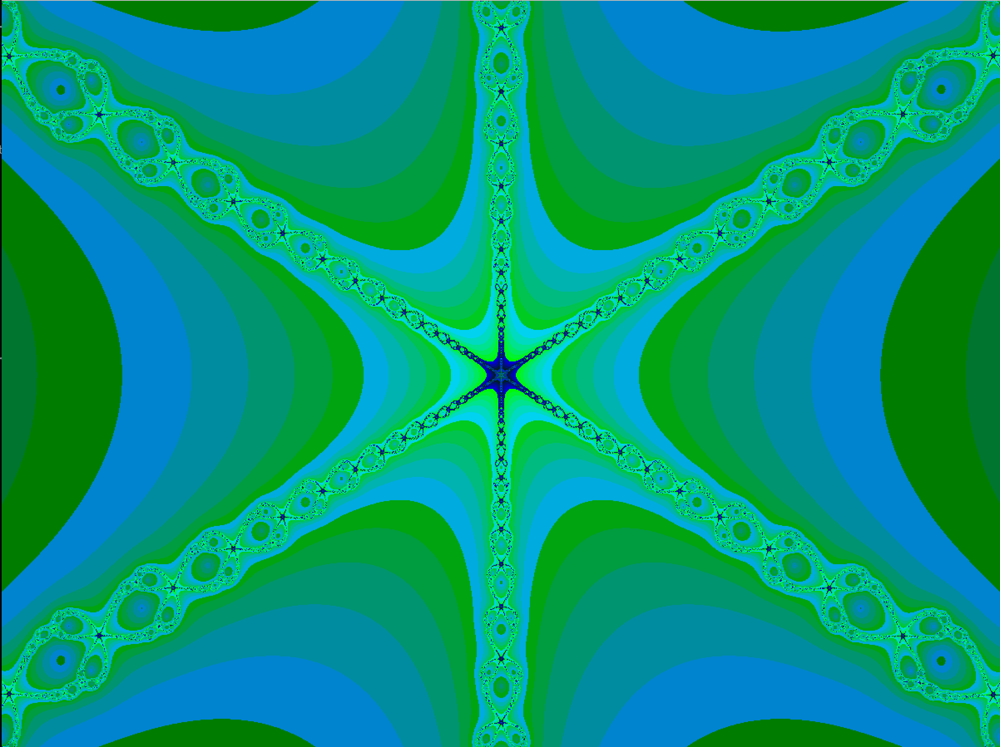
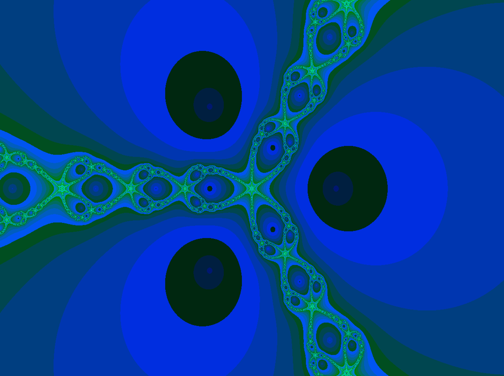
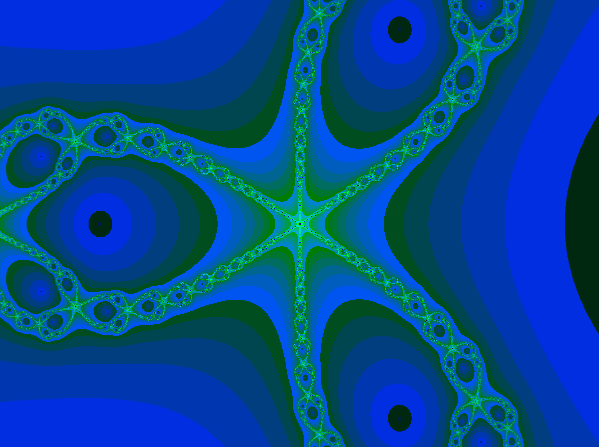
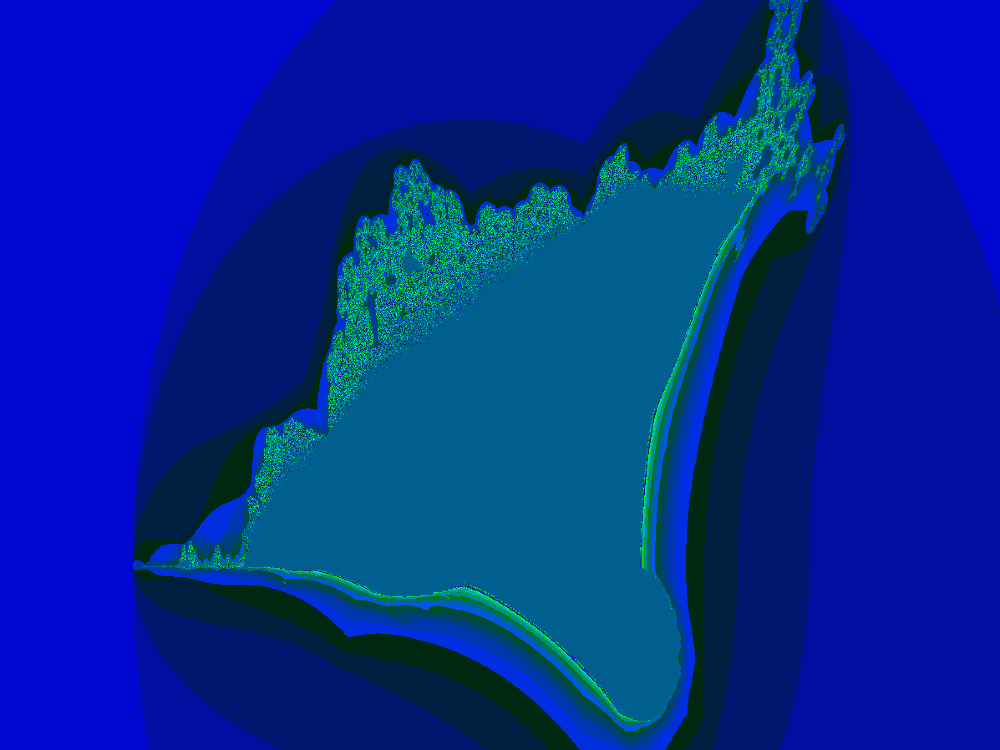

# Fract_ol
###### Ecole 42 - Second project of the graphic path

Computer graphics project, consisting in visual representation of fractal figures.

### Prerequisites

```
MacOs/Linux environment
```
### Usage



### Features

```
- 4 fractals available
- movement using arrows
- Infinite zoom to test self similarity through the mouse wheel
- the julia ensemble will take place by changing its shape following the mouse movement

```

### Julia fractal





### Mandelbrot fractal



### Newton fractal





### Burning Ship fractal



